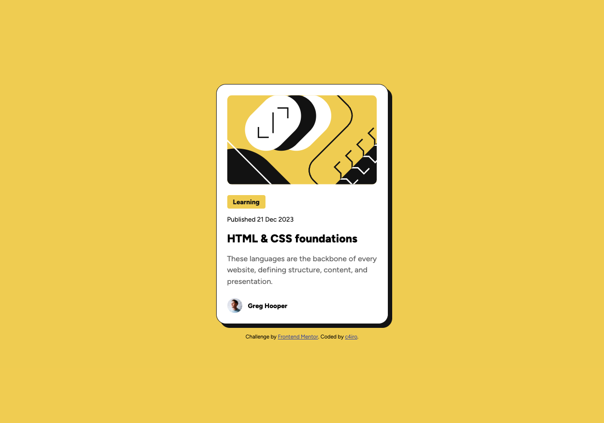
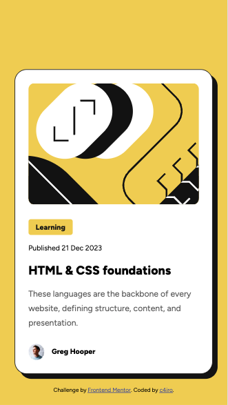
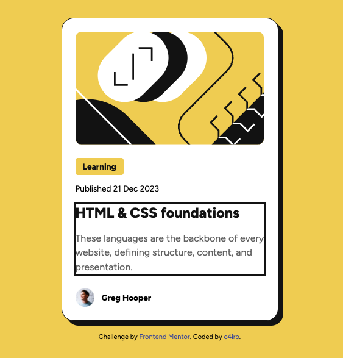
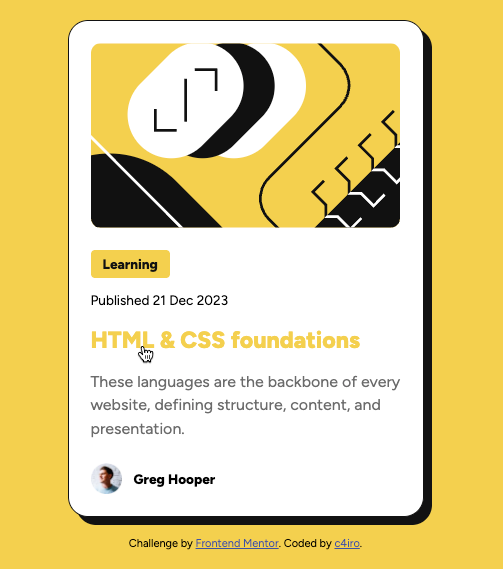

# Frontend Mentor - Blog preview card solution

This is my solution to the [Blog preview card challenge on Frontend Mentor](https://www.frontendmentor.io/challenges/blog-preview-card-ckPaj01IcS). Frontend Mentor challenges help you improve your coding skills by building realistic projects. 

## Table of contents

- [Overview](#overview)
  - [The challenge](#the-challenge)
  - [Screenshot](#screenshot)
  - [Links](#links)
- [My process](#my-process)
  - [Built with](#built-with)
  - [What I learned](#what-i-learned)
  - [Continued development](#continued-development)
  - [Useful resources](#useful-resources)
- [Author](#author)
- [Acknowledgments](#acknowledgments)

## Overview

### The challenge

Users should be able to:

- See hover and focus states for all interactive elements on the page

### Screenshot

#### Desktop

#### Mobile

#### Focus

#### Hover

### Links

- Solution URL: [https://github.com/c4iro-dev/blog-preview-card](https://github.com/c4iro-dev/blog-preview-card)
- Live Site URL: [https://c4iro-dev.github.io/blog-preview-card/](https://c4iro-dev.github.io/blog-preview-card/)

## My process

### Built with

- Semantic HTML5 markup
- CSS custom properties
- Flexbox

### What I learned

For this project, my main goal was to build as much of the HTML structure and CSS styling on my own, without relying on external references. I focused on writing semantic HTML and well-structured CSS, continuing to use root variables for consistent styling and keeping the code organized and maintainable.

Unlike my previous QR code project, I spent less time on pixel-perfect design and more on keeping the html and CSS simple and maintainable, while observing how changes affected the layout at different screen sizes. Specifically, I experimented with clamp() to make font sizes adjust automatically as the viewport size changed, giving me experience with responsive typography and scalable designs.

I also spent some time trying to understand hover and focus states better so that I could implement a styling that fit the branding of my elements well. While guidance was given on how the hover state should look, I had to come up with a focus styling on my own.

### Continued development

I want to continue improving my ability to write clean, semantic HTML and CSS that stays true to the original mockups. My next focus is on learning responsive design principles so I can make more intentional layout and typography adjustments for different screen sizes.

## Author

- Frontend Mentor - [@c4iro-dev](https://www.frontendmentor.io/profile/c4iro-dev)
- GitHub - [c4iro-dev](https://github.com/c4iro-dev)

## Acknowledgments

I appreciate Alex (https://github.com/AlexKMarshall) in the Frontend Mentor Discord for pointing me in the direction of experimenting with clamp() for the "Ideas to test yourself" item about font resizing without media queries. Alex been very responsive to questions I've had about my last two projects.